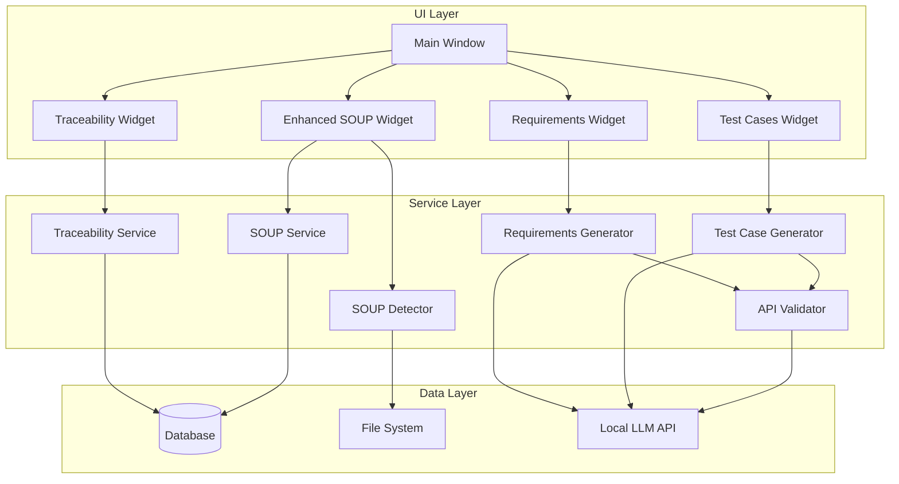
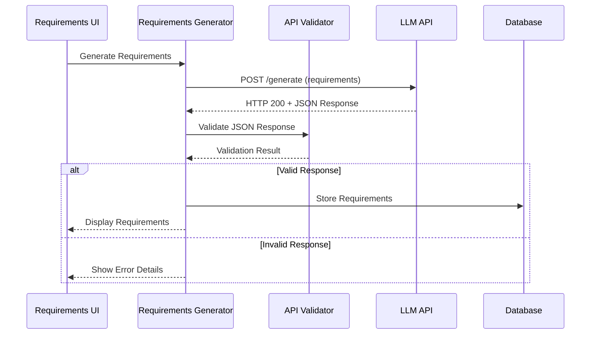

# Software Requirements Fixes Design Document

## Overview

This design document outlines the comprehensive solution for fixing critical issues in the medical software analyzer's requirements handling, traceability matrix display, API integration, test generation workflow, and SOUP component management. The solution addresses five key areas:

1. **Requirements GUI Display** - Enhanced UI for viewing and editing generated requirements
2. **Traceability Matrix Enhancement** - Proper tabular display with gap analysis and export capabilities
3. **API Response Validation** - Robust JSON response processing instead of HTTP status checking
4. **Test Case Generation Workflow** - Export-oriented test case generation with multiple formats
5. **IEC 62304 SOUP Management** - Automated detection and compliant management of SOUP components

## Architecture

### System Components Overview



### Enhanced Requirements Flow



## Components and Interfaces

### 1. Enhanced Requirements Display System

#### RequirementsTabWidget
**Purpose**: Comprehensive requirements management interface with editing capabilities

**Key Features**:
- Dual-pane view for User Requirements (URs) and Software Requirements (SRs)
- In-line editing with validation
- Real-time traceability updates
- Export functionality

**Interface**:
```python
class RequirementsTabWidget(QWidget):
    requirements_updated = pyqtSignal(dict)
    
    def __init__(self):
        self.user_requirements: List[Requirement] = []
        self.software_requirements: List[Requirement] = []
        
    def update_requirements(self, user_reqs: List[Requirement], software_reqs: List[Requirement])
    def add_user_requirement(self) -> None
    def edit_requirement(self, req_id: str) -> None
    def delete_requirement(self, req_id: str) -> None
    def export_requirements(self, format: str) -> str
    def validate_requirements(self) -> List[str]
```

#### RequirementEditDialog
**Purpose**: Modal dialog for detailed requirement editing

**Key Features**:
- Form-based editing with validation
- Acceptance criteria management
- Traceability link editing
- Priority and metadata management

### 2. Enhanced Traceability Matrix System

#### TraceabilityMatrixWidget
**Purpose**: Tabular display of complete traceability matrix with gap analysis

**Key Features**:
- Sortable/filterable tabular view
- Gap highlighting with visual indicators
- Export to multiple formats (CSV, Excel, PDF)
- Interactive cell details

**Interface**:
```python
class TraceabilityMatrixWidget(QWidget):
    def __init__(self):
        self.matrix_data: List[TraceabilityTableRow] = []
        self.gaps: List[TraceabilityGap] = []
        
    def update_matrix(self, matrix: TraceabilityMatrix) -> None
    def highlight_gaps(self, gaps: List[TraceabilityGap]) -> None
    def export_matrix(self, format: str, filename: str) -> bool
    def filter_matrix(self, criteria: Dict[str, Any]) -> None
    def get_cell_details(self, row: int, col: int) -> Dict[str, Any]
```

#### TraceabilityGapAnalyzer
**Purpose**: Identifies and categorizes traceability gaps

**Key Features**:
- Orphaned code detection
- Missing requirement links
- Weak traceability identification
- Gap severity assessment

### 3. API Response Validation System

#### APIResponseValidator
**Purpose**: Comprehensive validation of LLM API responses

**Key Features**:
- JSON schema validation
- Content completeness checking
- Error extraction and reporting
- Retry logic with exponential backoff

**Interface**:
```python
class APIResponseValidator:
    def __init__(self, expected_schemas: Dict[str, Dict]):
        self.schemas = expected_schemas
        
    def validate_response(self, response: requests.Response, operation: str) -> ValidationResult
    def extract_error_details(self, response: requests.Response) -> ErrorDetails
    def should_retry(self, response: requests.Response) -> bool
    def parse_generation_result(self, response_json: Dict) -> GenerationResult
```

#### Enhanced LocalServerBackend
**Purpose**: Improved API integration with proper response handling

**Key Features**:
- JSON response validation
- Detailed error reporting
- Automatic retry mechanisms
- Response caching for efficiency

### 4. Test Case Generation and Export System

#### TestCaseGenerator
**Purpose**: Generate exportable test case outlines instead of executable tests

**Key Features**:
- Template-based test case generation
- Multiple export formats
- Requirement-to-test traceability
- Coverage analysis

**Interface**:
```python
class TestCaseGenerator:
    def __init__(self, llm_backend: LLMBackend):
        self.llm_backend = llm_backend
        self.templates: Dict[str, TestTemplate] = {}
        
    def generate_test_cases(self, requirements: List[Requirement]) -> List[TestCase]
    def export_test_cases(self, test_cases: List[TestCase], format: str) -> str
    def generate_coverage_report(self, test_cases: List[TestCase]) -> CoverageReport
    def create_test_outline(self, requirement: Requirement) -> TestOutline
```

#### TestCaseExportWidget
**Purpose**: UI for test case generation and export

**Key Features**:
- Test case preview with syntax highlighting
- Multiple export format options
- Batch export capabilities
- Test organization by requirement

### 5. IEC 62304 Compliant SOUP Management

#### SOUPDetector
**Purpose**: Automatically detect SOUP components from project files

**Key Features**:
- Multi-format dependency file parsing
- Component classification
- Version tracking
- Change impact assessment

**Interface**:
```python
class SOUPDetector:
    def __init__(self):
        self.parsers: Dict[str, DependencyParser] = {}
        
    def detect_soup_components(self, project_path: str) -> List[DetectedSOUPComponent]
    def classify_component(self, component: DetectedSOUPComponent) -> IEC62304Classification
    def assess_safety_impact(self, component: DetectedSOUPComponent) -> SafetyAssessment
    def track_version_changes(self, old_components: List, new_components: List) -> List[VersionChange]
```

#### Enhanced SOUPService
**Purpose**: IEC 62304 compliant SOUP component management

**Key Features**:
- Automatic classification (Class A/B/C)
- Safety justification templates
- Change impact tracking
- Compliance reporting

#### IEC62304ComplianceManager
**Purpose**: Ensure SOUP management meets IEC 62304 requirements

**Key Features**:
- Classification validation
- Documentation completeness checking
- Change control workflow
- Audit trail maintenance

## Data Models

### Enhanced Requirement Model
```python
@dataclass
class Requirement:
    id: str
    text: str
    type: RequirementType
    acceptance_criteria: List[str]
    derived_from: List[str]
    priority: str = "medium"
    status: str = "draft"
    metadata: Dict[str, Any] = field(default_factory=dict)
    created_at: datetime = field(default_factory=datetime.now)
    updated_at: datetime = field(default_factory=datetime.now)
    
    def validate(self) -> List[str]
    def update_traceability(self, new_links: List[str]) -> None
    def export_to_dict(self) -> Dict[str, Any]
```

### Test Case Models
```python
@dataclass
class TestCase:
    id: str
    name: str
    description: str
    requirement_id: str
    preconditions: List[str]
    test_steps: List[TestStep]
    expected_results: List[str]
    priority: str
    category: str
    metadata: Dict[str, Any] = field(default_factory=dict)

@dataclass
class TestStep:
    step_number: int
    action: str
    expected_result: str
    notes: str = ""

@dataclass
class TestOutline:
    test_cases: List[TestCase]
    coverage_summary: Dict[str, Any]
    export_formats: List[str]
    generation_metadata: Dict[str, Any]
```

### Enhanced SOUP Models
```python
@dataclass
class DetectedSOUPComponent:
    name: str
    version: str
    source_file: str
    detection_method: str
    confidence: float
    suggested_classification: str
    metadata: Dict[str, Any] = field(default_factory=dict)

@dataclass
class IEC62304Classification:
    safety_class: str  # "A", "B", or "C"
    justification: str
    risk_assessment: str
    verification_requirements: List[str]
    documentation_requirements: List[str]

@dataclass
class SafetyAssessment:
    component_id: str
    safety_impact: str
    failure_modes: List[str]
    mitigation_measures: List[str]
    verification_methods: List[str]
```

### API Validation Models
```python
@dataclass
class ValidationResult:
    is_valid: bool
    errors: List[str]
    warnings: List[str]
    extracted_data: Optional[Dict[str, Any]]
    confidence: float

@dataclass
class ErrorDetails:
    error_code: str
    error_message: str
    error_context: Dict[str, Any]
    suggested_action: str
    is_recoverable: bool
```

## Error Handling

### API Response Error Handling
1. **HTTP Status Validation**: Check for 2xx status codes
2. **JSON Structure Validation**: Validate against expected schemas
3. **Content Completeness**: Ensure all required fields are present
4. **Semantic Validation**: Check for logical consistency
5. **Retry Logic**: Exponential backoff for recoverable errors

### Requirements Validation
1. **Syntax Validation**: Check requirement format and structure
2. **Traceability Validation**: Ensure valid links between requirements
3. **Completeness Validation**: Check for missing acceptance criteria
4. **Consistency Validation**: Verify requirement relationships

### SOUP Component Validation
1. **IEC 62304 Compliance**: Ensure all required fields are present
2. **Classification Validation**: Verify safety class assignments
3. **Documentation Completeness**: Check for required justifications
4. **Version Consistency**: Validate version information

## Testing Strategy

### Unit Testing
- **Requirements Management**: Test requirement CRUD operations, validation, and traceability
- **API Validation**: Test response parsing, error handling, and retry logic
- **SOUP Detection**: Test component detection across different file formats
- **Test Case Generation**: Test template processing and export functionality

### Integration Testing
- **End-to-End Requirements Flow**: Test complete requirements generation and display
- **Traceability Matrix Generation**: Test matrix creation and gap analysis
- **API Integration**: Test actual API calls with validation
- **SOUP Workflow**: Test detection, classification, and management workflow

### UI Testing
- **Requirements Widget**: Test editing, validation, and export functionality
- **Traceability Matrix**: Test sorting, filtering, and export features
- **Test Case Export**: Test generation and export in multiple formats
- **SOUP Management**: Test component addition, editing, and compliance checking

### Performance Testing
- **Large Dataset Handling**: Test with projects containing many requirements/components
- **API Response Times**: Test timeout handling and retry mechanisms
- **Export Performance**: Test large data export operations
- **UI Responsiveness**: Test UI performance with complex data sets

## Implementation Phases

### Phase 1: API Response Validation
1. Implement APIResponseValidator class
2. Enhance LocalServerBackend with proper JSON validation
3. Add detailed error reporting and retry logic
4. Update requirements generation to use validation

### Phase 2: Requirements GUI Enhancement
1. Create RequirementsTabWidget with dual-pane layout
2. Implement RequirementEditDialog with validation
3. Add real-time editing and traceability updates
4. Integrate with existing results tab system

### Phase 3: Traceability Matrix Enhancement
1. Enhance TraceabilityService with gap analysis
2. Create TraceabilityMatrixWidget with tabular display
3. Implement export functionality (CSV, Excel, PDF)
4. Add interactive gap highlighting and details

### Phase 4: Test Case Generation System
1. Implement TestCaseGenerator with template system
2. Create TestCaseExportWidget for UI
3. Add multiple export format support
4. Integrate with requirements for traceability

### Phase 5: IEC 62304 SOUP Management
1. Implement SOUPDetector for automatic detection
2. Enhance SOUPService with IEC 62304 compliance
3. Create IEC62304ComplianceManager
4. Update SOUPWidget with enhanced features

### Phase 6: Integration and Testing
1. Integrate all components into main application
2. Comprehensive testing across all features
3. Performance optimization and bug fixes
4. Documentation and user guide updates

## Security Considerations

### Data Protection
- Encrypt sensitive SOUP component information
- Secure API communication with proper authentication
- Validate all user inputs to prevent injection attacks
- Implement proper access controls for requirement editing

### API Security
- Validate all API responses to prevent malicious content
- Implement rate limiting for API calls
- Use secure HTTP connections where possible
- Log security-relevant events for audit trails

### File System Security
- Validate file paths to prevent directory traversal
- Sanitize exported file content
- Implement proper file permissions
- Secure temporary file handling

## Performance Optimization

### Caching Strategy
- Cache API responses for repeated requests
- Cache traceability matrix calculations
- Cache SOUP component detection results
- Implement intelligent cache invalidation

### Database Optimization
- Index frequently queried fields
- Optimize traceability link queries
- Implement connection pooling
- Use prepared statements for security and performance

### UI Performance
- Implement lazy loading for large datasets
- Use virtual scrolling for large tables
- Optimize rendering for complex traceability matrices
- Implement progressive loading for exports

## Monitoring and Logging

### Application Logging
- Log all API interactions with response validation results
- Track requirement changes and traceability updates
- Monitor SOUP component detection and classification
- Log export operations and performance metrics

### Error Tracking
- Comprehensive error logging with context
- User action tracking for debugging
- Performance metrics collection
- Automated error reporting for critical issues

### Audit Trail
- Track all requirement modifications
- Log SOUP component changes for compliance
- Maintain traceability link history
- Record user actions for regulatory compliance