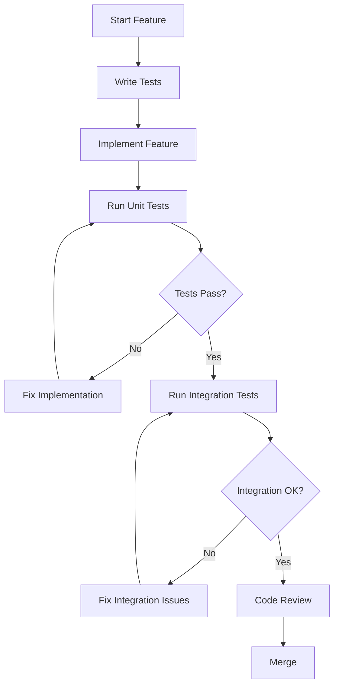
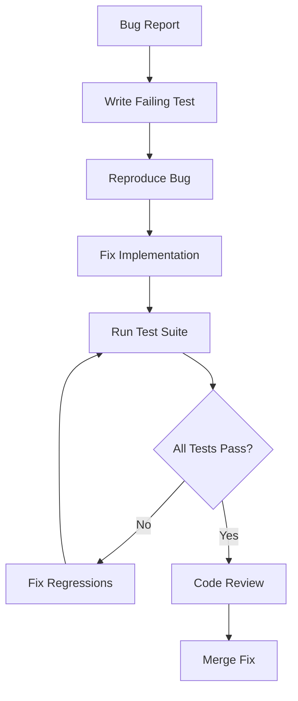
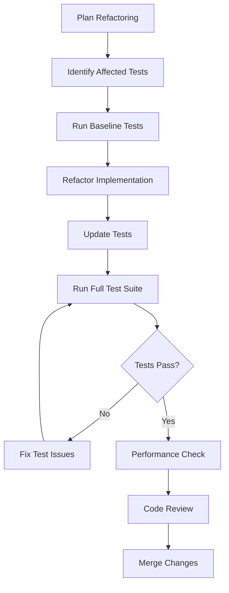

# Test Maintenance Guide

## Overview

This guide provides comprehensive documentation for maintaining the test suite of the medical software analyzer project. It covers common test failure patterns, solutions, and procedures for preventing similar issues in the future.

## Table of Contents

1. [Common Test Failure Patterns](#common-test-failure-patterns)
2. [Test-Implementation Synchronization Guidelines](#test-implementation-synchronization-guidelines)
3. [Prevention Procedures](#prevention-procedures)
4. [Development Workflow Integration](#development-workflow-integration)
5. [Troubleshooting Guide](#troubleshooting-guide)
6. [Best Practices](#best-practices)

## Common Test Failure Patterns

### 1. Mock Configuration Mismatches

**Pattern**: Tests fail due to mock objects returning unexpected values or types.

**Common Symptoms**:
- `AssertionError: Expected 'openai' but got 'mock'`
- Backend type mismatches in configuration tests
- Mock methods not behaving like real implementations

**Root Causes**:
- Mock configurations not updated when implementation changes
- Inconsistent mock setup across test modules
- Missing mock method implementations

**Solutions**:
```python
# ❌ Incorrect - Generic mock without proper configuration
mock_config = Mock()
mock_config.get_backend_type.return_value = Mock()

# ✅ Correct - Properly configured mock with expected return types
mock_config = Mock()
mock_config.get_backend_type.return_value = 'openai'
mock_config.validate.return_value = True
```

**Prevention**:
- Use `MockConfigurationManager` from `tests/test_utils.py`
- Validate mock behavior against real implementations
- Update mocks when changing implementation interfaces

### 2. UI Component Attribute Errors

**Pattern**: Tests fail when checking UI component properties that don't exist or have been renamed.

**Common Symptoms**:
- `AttributeError: 'QWidget' object has no attribute 'errors_group'`
- Widget visibility assertions failing
- Signal emission tests not working

**Root Causes**:
- UI component refactoring without updating tests
- Incorrect widget attribute names in tests
- Missing widget initialization in test setup

**Solutions**:
```python
# ❌ Incorrect - Checking non-existent attribute
assert widget.errors_group.isVisible()

# ✅ Correct - Check actual widget structure
assert hasattr(widget, 'error_label')
assert widget.error_label.isVisible()
```

**Prevention**:
- Use `UITestHelper.verify_widget_visibility()` for consistent checks
- Document UI component public interfaces
- Run UI tests after any widget refactoring

### 3. Import and Dependency Issues

**Pattern**: Tests fail due to missing imports or circular dependencies.

**Common Symptoms**:
- `NameError: name 'QTableWidgetItem' is not defined`
- `ImportError: cannot import name 'X' from 'Y'`
- Module not found errors

**Root Causes**:
- Missing imports in test files
- Circular import dependencies
- Incorrect import paths after refactoring

**Solutions**:
```python
# ❌ Incorrect - Missing import
def test_table_interaction():
    item = QTableWidgetItem("test")  # NameError

# ✅ Correct - Proper import
from PyQt6.QtWidgets import QTableWidgetItem

def test_table_interaction():
    item = QTableWidgetItem("test")
```

**Prevention**:
- Use `ensure_required_imports()` from test utilities
- Validate imports during test collection
- Use absolute imports where possible

### 4. Error Handling Validation Failures

**Pattern**: Tests expecting exceptions fail because exceptions aren't raised or wrong exception types are raised.

**Common Symptoms**:
- `AssertionError: FileNotFoundError not raised`
- Tests expecting `None` but getting exceptions
- Wrong exception types being caught

**Root Causes**:
- Implementation changed error handling behavior
- Test setup doesn't create error conditions
- Incorrect exception type expectations

**Solutions**:
```python
# ❌ Incorrect - Expecting None return for error case
result = parser.parse_file("nonexistent.txt")
assert result is None

# ✅ Correct - Expecting proper exception
with pytest.raises(FileNotFoundError):
    parser.parse_file("nonexistent.txt")
```

**Prevention**:
- Document expected error handling behavior
- Test both success and failure paths
- Use proper exception testing patterns

### 5. Signal and Event Handling Issues

**Pattern**: Tests fail when verifying signal emissions or event handling.

**Common Symptoms**:
- Signal emission counts don't match expectations
- Event processing not completing before assertions
- Signal connections not working in tests

**Root Causes**:
- Asynchronous signal processing not accounted for
- Missing event loop processing in tests
- Signal connections not established properly

**Solutions**:
```python
# ❌ Incorrect - Not processing events before assertion
widget.trigger_action()
assert signal_spy.count() == 1  # May fail due to timing

# ✅ Correct - Process events before assertion
widget.trigger_action()
UITestHelper.process_events()
assert signal_spy.count() == 1
```

**Prevention**:
- Use `UITestHelper.process_events()` after UI actions
- Use `UITestHelper.count_signal_emissions()` for reliable counting
- Test signal connections explicitly

## Test-Implementation Synchronization Guidelines

### 1. Interface Consistency

**Principle**: Tests should reflect the actual public interface of components.

**Guidelines**:
- Update tests immediately when changing public interfaces
- Use integration tests to verify component interactions
- Document breaking changes and their test impacts

**Example Workflow**:
1. Change implementation interface
2. Run affected tests to identify failures
3. Update test expectations to match new interface
4. Verify no regressions in related components

### 2. Mock Synchronization

**Principle**: Mock objects should behave like real implementations.

**Guidelines**:
- Update mocks when implementation behavior changes
- Use consistent mock configurations across test modules
- Validate mock behavior against real implementations

**Mock Update Checklist**:
- [ ] Return types match implementation
- [ ] Method signatures are consistent
- [ ] Error conditions are properly mocked
- [ ] Side effects are accounted for

### 3. Data Model Consistency

**Principle**: Test data should match actual data model requirements.

**Guidelines**:
- Update test data when model validation changes
- Use factory functions for consistent test data creation
- Validate test data against actual model constraints

**Example**:
```python
# ✅ Good - Use factory for consistent test data
def create_test_component():
    return SOUPComponent(
        id="test-comp-001",  # Matches ID format requirements
        name="Test Component",
        version="1.0.0",
        # ... other required fields
    )
```

## Prevention Procedures

### 1. Pre-Commit Validation

**Automated Checks**:
- Run affected tests before committing changes
- Validate import statements in modified files
- Check mock configurations for consistency

**Git Hook Example**:
```bash
#!/bin/bash
# Pre-commit hook for test validation
python -m pytest tests/ -x --tb=short
if [ $? -ne 0 ]; then
    echo "Tests failed. Please fix before committing."
    exit 1
fi
```

### 2. Code Review Guidelines

**Review Checklist**:
- [ ] Tests updated for interface changes
- [ ] Mock configurations remain consistent
- [ ] Error handling tests cover new scenarios
- [ ] UI tests account for widget changes

### 3. Continuous Integration Enhancements

**CI Pipeline Additions**:
- Run tests on multiple Python versions
- Generate test coverage reports
- Validate test execution time limits
- Check for test warnings and deprecations

### 4. Documentation Requirements

**Documentation Updates**:
- Update API documentation for interface changes
- Document new error conditions and handling
- Update test documentation for new patterns
- Maintain changelog for breaking changes

## Development Workflow Integration

### 1. Feature Development Workflow



### 2. Bug Fix Workflow



### 3. Refactoring Workflow



## Troubleshooting Guide

### 1. Test Failure Investigation

**Step-by-Step Process**:

1. **Identify Failure Type**:
   ```bash
   # Run specific failing test with verbose output
   python -m pytest tests/test_module.py::test_function -v -s
   ```

2. **Analyze Error Message**:
   - AssertionError: Check expected vs actual values
   - AttributeError: Verify object interfaces
   - ImportError: Check import statements and paths
   - TypeError: Validate argument types and signatures

3. **Check Recent Changes**:
   ```bash
   # Find recent changes to related files
   git log --oneline -10 -- path/to/related/files
   ```

4. **Validate Test Environment**:
   ```bash
   # Check test dependencies
   python -c "import pytest; print(pytest.__version__)"
   python -c "from PyQt6 import QtWidgets; print('PyQt6 OK')"
   ```

### 2. Common Fix Patterns

**Mock Configuration Fixes**:
```python
# Before: Generic mock
mock_service = Mock()

# After: Properly configured mock
mock_service = Mock()
mock_service.method.return_value = expected_value
mock_service.property = expected_property
```

**UI Test Fixes**:
```python
# Before: Direct attribute access
assert widget.some_attribute.isVisible()

# After: Safe attribute checking
assert hasattr(widget, 'some_attribute')
assert widget.some_attribute.isVisible()
```

**Import Fixes**:
```python
# Before: Missing import
def test_function():
    item = QTableWidgetItem("test")  # NameError

# After: Proper import
from PyQt6.QtWidgets import QTableWidgetItem

def test_function():
    item = QTableWidgetItem("test")
```

### 3. Performance Issues

**Slow Test Diagnosis**:
```bash
# Profile test execution time
python -m pytest --durations=10 tests/

# Run specific slow test with profiling
python -m pytest tests/slow_test.py --profile
```

**Common Solutions**:
- Use mocks instead of real services for unit tests
- Optimize test data creation
- Parallelize independent tests
- Cache expensive setup operations

## Best Practices

### 1. Test Organization

**File Structure**:
```
tests/
├── conftest.py              # Shared fixtures and configuration
├── test_utils.py            # Test utilities and helpers
├── unit/                    # Unit tests
│   ├── test_services/
│   ├── test_models/
│   └── test_parsers/
├── integration/             # Integration tests
└── ui/                      # UI-specific tests
```

**Naming Conventions**:
- Test files: `test_<module_name>.py`
- Test classes: `Test<ComponentName>`
- Test methods: `test_<specific_behavior>`

### 2. Test Data Management

**Use Factories**:
```python
def create_test_component(**kwargs):
    defaults = {
        'id': 'test-comp-001',
        'name': 'Test Component',
        'version': '1.0.0',
    }
    defaults.update(kwargs)
    return SOUPComponent(**defaults)
```

**Fixture Organization**:
```python
@pytest.fixture
def sample_component():
    return create_test_component()

@pytest.fixture
def invalid_component():
    return create_test_component(id='')  # Invalid ID
```

### 3. Assertion Patterns

**Clear Assertions**:
```python
# ❌ Unclear assertion
assert len(results) > 0

# ✅ Clear assertion with message
assert len(results) > 0, f"Expected results but got empty list: {results}"
```

**Specific Assertions**:
```python
# ❌ Generic assertion
assert response

# ✅ Specific assertion
assert response.status_code == 200
assert 'data' in response.json()
```

### 4. Test Isolation

**Independent Tests**:
```python
class TestComponent(DeterministicTestMixin):
    def test_feature_a(self):
        # Test doesn't depend on other tests
        component = create_component()
        result = component.feature_a()
        assert result == expected_value
```

**Proper Cleanup**:
```python
@pytest.fixture
def temp_database():
    db_path = create_temp_database()
    yield db_path
    cleanup_database(db_path)  # Always cleanup
```

## Conclusion

Following these guidelines will help maintain a robust, reliable test suite that supports confident development and deployment. Regular review and updates of these procedures ensure they remain effective as the project evolves.

For questions or suggestions about test maintenance, please refer to the development team or create an issue in the project repository.